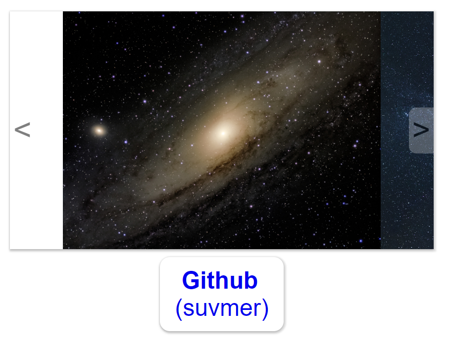

# SliderJS
Необычный по замыслу собственный слайдер.

## Преимущества:
Легко листается свайпом на ПК(обработка событий мыши) и на телефоне(media запрос с scroll-snap-align)

## Поведение слайдера:
При свайпе от центра более, чем на 1/6 от ширины изображения, слайдер пролистает до соседней картинки.
Если свайп мышкой ушёл дальше соседей, то при отжатии слайдер притянет картинку, на которую попал центр его окна.

Demo: 

